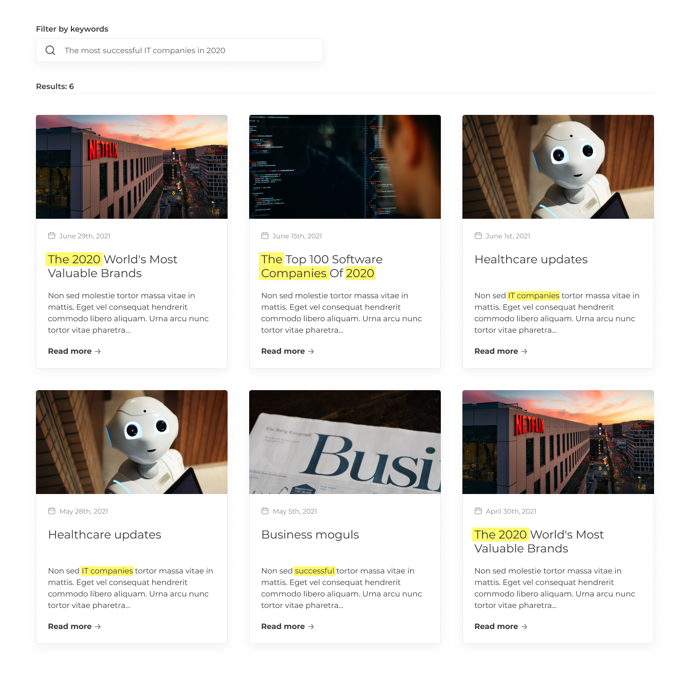

# Spaceflightnews

This is a smart project of a frontend for the [Spaceflight News API](https://spaceflightnewsapi.net/) for educational purposes. 

## Description

This web app is a simple frontend to show the latest news about space and tech. By tdefault you can see a all news in MatCards with the pic, the headline and a its summary, you can click on the `Read more` option to get the full article. You can also search any specific by its summary and/or its headline using keywords.

## Homepage

1. Cards with article titles and descriptions for 100 characters. The user can click on the card to go to an article page that contains the title and full description of the selected article.
2.  A field to filter by keyword. The user enters keywords into the field and the system displays all articles containing at least one of the keywords in the name or/and description.
 - The priority of fields: (1) names; and (2) description. The article with one match in the name is higher than the article with one match in the description.
- The matched keywords should be highlighted with yellow color.

Theresult should be something as follows:

## Article view

If the option of `Read more ->` is clicked, the view of the full article should look as follows:

## Note

This is a real project assigment for a technical test of a __Junior frontend__ position in Angular